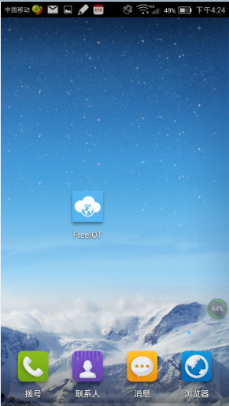
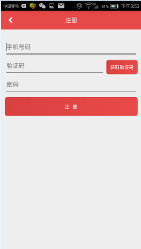
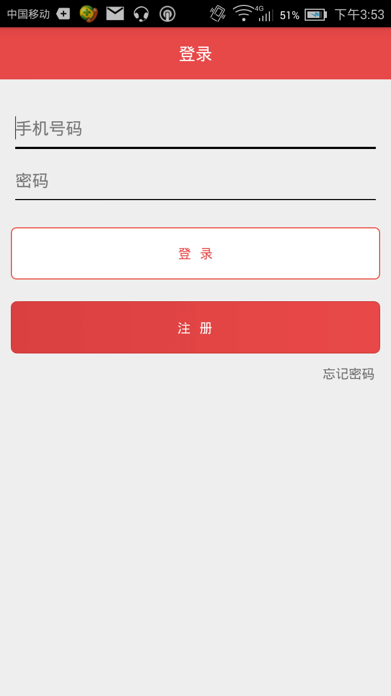
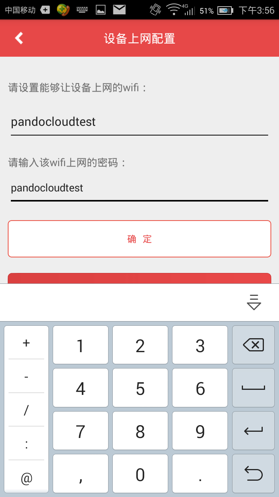

## Android app 操作指南  
下载[freeiot](http://www.wandoujia.com/apps/com.pandocloud.freeiot)。  
freeiot与设备之间通过smartconfig进行配置。FreeIOT是Tisan的在移动端的通用App，自由免费的，同时开源，有兴趣的开发者可下载[FreeIOT源码](https://github.com/PandoCloud/freeiot-android)参考研究。  

   
下面介绍App与设备之间的操作流程：   
1 安装**FreeIOT**  
    
  
2 启动FreeIOT，如果没有账户，先注册用户，再登陆。  
注册用户：     
  
用户登陆：    
  
    
3 长按Tisan开发板的配置键3秒，LED快闪，表示设备进入配置模式 
4 点击FreeIOT右上角的“添加”键，输入能够联网的WiFi以及密码，输完后点击“确定”，静等5到10秒，配置成功后会返回设备列表界面；  
  
  
5 如果没配上，可重复操作步骤3和步骤4；  
6 配置成功后，往下拉一下，刷新设备列表，找到刚配置成功的设备，点击进去，就进入操作该设备的主界面！用户可进行设备状态查询、远程控制等功能。   

   

