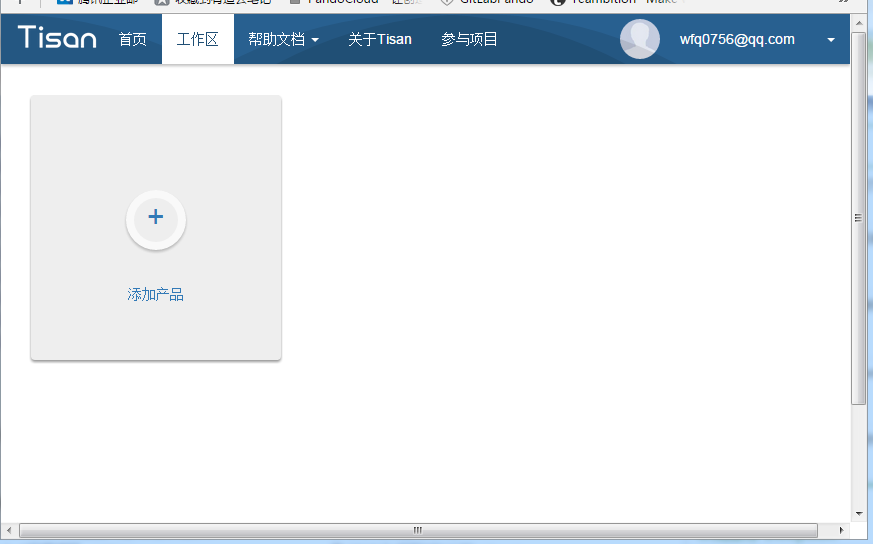
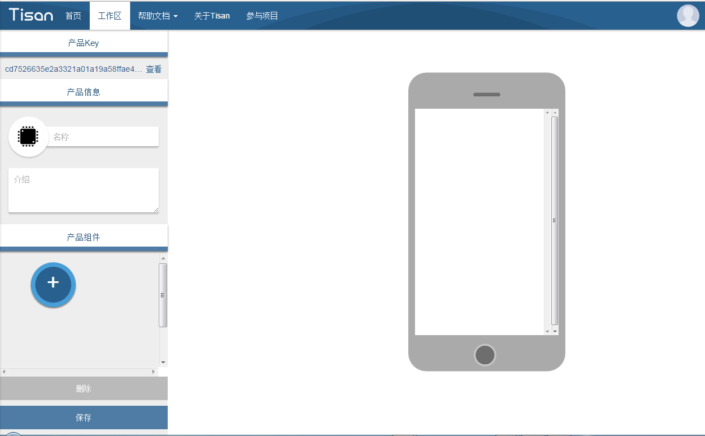
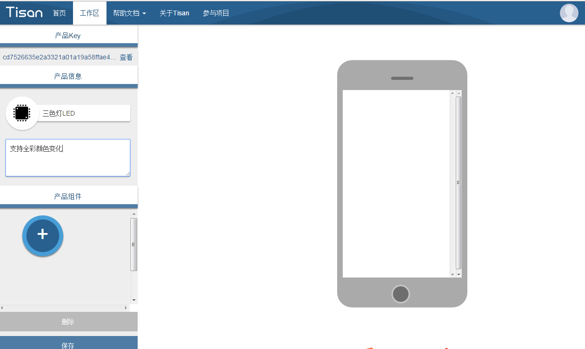
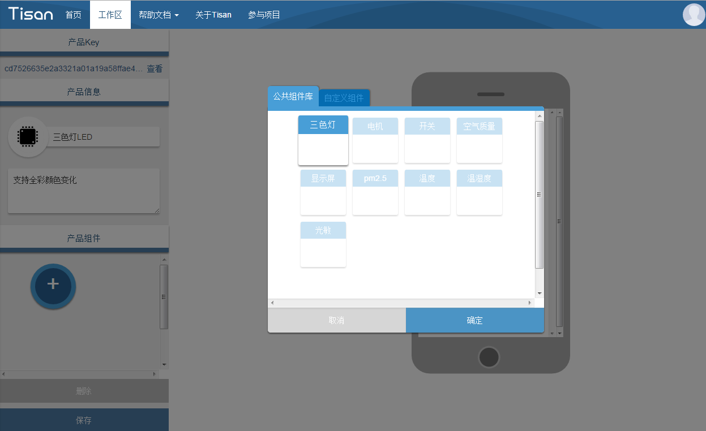
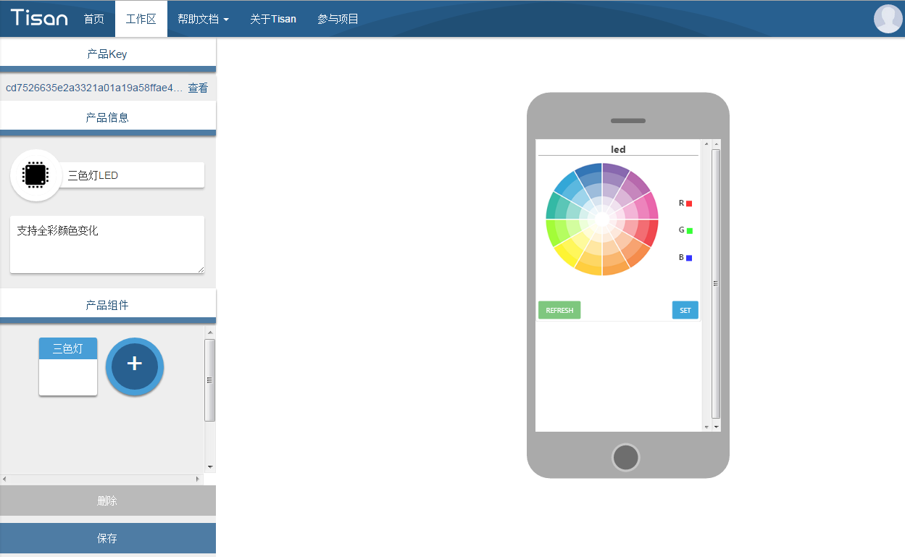
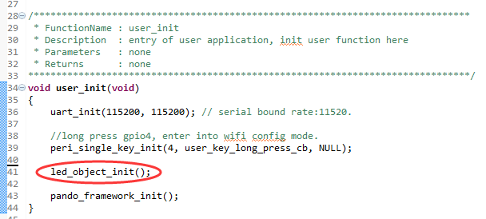

# 开发指南  

这里给开发者讲解如何进行固件开发，如何结合WebIDE开发自己的产品。

## 准备工作  
 搭建环境和准备好SDK，参考[开发环境](environment.md)  

## 在WebIDE中添加产品  
如果是首次使用[WebIDE](http://tisan.pandocloud.com)，请先注册账号，并登陆，在工作区里面进行产品开发，注意该IDE只支持Google Chrome浏览器，请先安装该浏览器。  

1. 在工作区添加产品:  
  

2. 获取产品Key，录入产品信息（产品名称、介绍），添加产品需要的组件，操作结束后保存:  
    

3. 录入产品信息、介绍：  
    

4. 添加产品需要的组件:    
   

5. 添加完成后可直接浏览手机应用程序的界面:    
   

6. 最后保存  
    


## 取得产品Key  
在WebIDE的工作区添加产品，取得产品key：  
   
点击“查看”，在弹出框里将key的字符串复制到device_config.h文件中宏定义PANDO_PRODUCT_KEY的值。  
device_config.h文件在SDK的 **app/user** 目录下：  
   
  

## 组织产品组件代码   
**说明：如果直接采用Tisan DEMO里面的默认示例，则已经实现该步骤，可直接进入[添加初始化代码](#添加初始化代码)操作即可。**  
点击WebIDE中产品组件区域所选的组件，会弹出一个代码预览框，该代码即为pando框架中object（组件）的基础代码，复制的SDK中 **app/user/objects** 目录下，只要稍作修改就可以使用。 下面示例是一个RGB灯的产品示例：  
   
代码预览中的led.c和led.h复制到SDK中 **app/user/objects** 目录下，如图：  
  
需要对led.c补充驱动代码，注意是补充代码中**TODO:**的函数：  

- 首先添加外设驱动的引用：    
```c
#include "../../peripheral/peri_rgb_light.h"
``` 
- 补充初始化函数，注意，初始化调用的外设请在**peripheral**中相应的驱动里面去配置：  
```c  
void ICACHE_FLASH_ATTR
led_init()
{
	peri_rgb_light_init();
}
```
- 补充set和get方法，在这里是led_set以及led_get方法：  
```c  
void ICACHE_FLASH_ATTR
led_set(struct led* value)  
{  
	struct LIGHT_PARAM light_value;  
	light_value.pwm_duty[0] = value->red;  
	light_value.pwm_duty[1] = value->green;  
	light_value.pwm_duty[2] = value->blue;  
	peri_rgb_light_param_set(light_value);  
}  
```  
```c  
void ICACHE_FLASH_ATTR
led_get(struct led* value)
{
	struct LIGHT_PARAM light_value;
	light_value = peri_rgb_light_param_get();
	light_value.pwm_duty[0] = value->red;
	light_value.pwm_duty[1] = value->green;
	light_value.pwm_duty[2] = value->blue;
}
```  
- 另外如果object还有其他需要**TODO:**的地方，请参考TODO的提示来进行代码补充。  

## 添加初始化代码
在工程的入口函数user_init（在user_main.c里) 添加组件的初始化代码和相应的头文件。  
添加规则：  
在相应组件的.h文件找到初始化函数名(_init()结尾），例如led.h里面的led_object_init()。  
如图：  
  

## 编译代码  
代码补充完毕后，直接编译，生成bin文件，就可以对Tisan进行烧录了！ 烧录的方法请参考[固件烧录](environment.md##如何烧写固件)   


  


