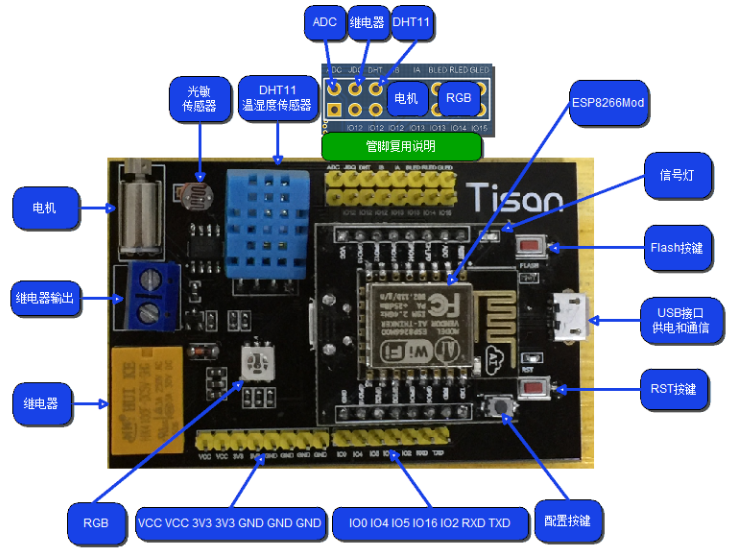

## 概述  
Tisan物联网开发板由核心板和底板组成。  
Tisan的核心板基于乐鑫的ESP8266。ESP8266是一款SOC WIFI芯片，可将设备连接到Wi-Fi网络上，进行互联网或局域网通信，实现联网功能。  
Tisan底板，也叫Tisan基板，连接核心板和支持接入各种外设板，板载几种典型的传感器。  
## 技术规格  
 
核心板的核心模块型号是ESP-12。ESP8266是一款高度集成的芯片，该芯片专门针对无线连接的需求而开发，是一个完整且自成系统的 Wi-Fi 网络解决方案。[芯片手册下载](http://bbs.espressif.com/download/file.php?id=714)  
  
###开发板资源介绍  

### Tisan 技术规格   

| 类型 | 规格/参数 |  
| --- | --------- |  
| 芯片 | ESP8266EX |  
| 工作电压 | 3.3V |  
| 输入电压 | 5V |  
| 数字IO管脚数 | 11 |    
| PWM管脚 | 自定义、可扩展 |  
| 模拟管脚数 | 1个 |  
| SPI | 1个 |
| UART | 2个，其中一个只有TXD功能 |  
| Flash存储 | 4MB（25Q32） |  
| 按键 | 3个。配置按键、复位按键，和烧写按键 |  
| LED | 1个用户LED |  
| 板载应用模块 | 三色灯模块、温湿度模块、继电器模块、电机模块，以及光敏模块 |  
| 尺寸 | 69mm＊45mm＊19mm |  

 
### 电源  
Tisan开发板通过USB供电。电源管脚说明：    
- **5V**  USB 5V电源供电。  
- **3V3**  由板上的3.3V稳压芯片提供。   
- **GND**  接地管脚。  

### MCU  
Tisan核心板上采用的是安信可科技的ESP-12模块：  
- **主控** 封装了ESP8266EX芯片。  
- **主频** 支持80MHz和160MHz。    
- **内存** ESP8266EX内置SRAM，由于需要加载基本的固件，用户可用剩余SRAM控件约为50KB（station模式下，连上路由后，heap+data区大致可用50KB左右）。    
ESP8266EX芯片的数据手册、硬件使用指南、管脚清单等资料可以在乐鑫官网的论坛里面下载,[芯片使用指南](http://bbs.espressif.com/viewtopic.php?f=21&t=412&p=1545#p1545)   
  
### 存储  
Tisan核心板上ESP-12模块封装了ESP8266EX芯片和一个25Q32的Flash芯片，容量为4M字节，用户程序存放在外部的SPI Flash中。  
     
### 功能和管脚说明    
底板的管脚是从核心板上引出。  
开发板有11个通用GPIO可以设置为输入或输出，工作电压为3.3V。每一路IO口最大驱动能力为12mA。  
管脚使用清单：  

| 功能名称 | 管脚号 | 说明 |    
| ---- | ------ | ---- |    
| 通用串口 | RXD：GPIO1，TXD：GPIO3 | 对应了Tisan板上的TXD和RXD管脚，用于接收或者发送TTL电平信号的串口数据。这些管脚连接到相应的CH340的USB转TTL电平的串口芯片上。 |    
| 串口1 | TXD：GPIO2 | 改串口只有TX部分可以用 |    
| PWM |  通用GPIO即可 | PWM接口由软件实现，GPIO的PWM功能可自行扩展和定义。 |     
| SPI | MISO：GPIO12，MOSI：GPIO13，CLK：GPIO14，CS：GPIO15 | 注意这几个管脚都有复用，选用SPI功能的时候，就不能用作其他外设了。 |   
| LED | GPIO5 | 核心板载信号灯 |   
| 配置按键 | GPIO4 | 核心板载配置按键，用于配置wifi连接 |  
| 复位按键 | RST | 底板载复位按键，用于复位重启开发板 |  
| Flash按键 | GPIO0 | 烧写程序时的启动按键 |  
| DHT11温湿度传感器 | GPIO12 | 注意管脚复用，不要跟其他外设共用管脚 |  
| 继电器 | GPIO12 | 注意管脚复用，不要跟其他外设共用管脚 |  
| 电机 | GPIO12，GPIO13 | 电机支持正反转，注意管脚复用，不要跟其他外设共用管脚 |  
| RGB三色灯 | Blue：GPIO13，Red：GPIO14，Green：GPIO15 | 注意管脚复用，不要跟其他外设共用管脚 |   
  
另外，Tisan有一个ADC管脚，连接了光敏模块。该ADC管脚支持精度为10bit，可检测的模拟输入电压范围是0~1V。  

## 硬件开源文档 
### 包括：原理图、电路图和装配图  
**TISAN开发板原理图**包括了[核心板原理图](reference/tisan-core-board.png)和[底板原理图](reference/tisan-base-board.pdf)  
**TISAN电路图**包括了[核心板电路图](reference/tisan-core_pcb.pdf)和[底板电路图](reference/tisan_base_pcb.pdf)   
