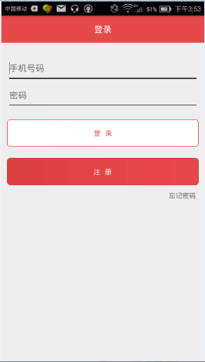
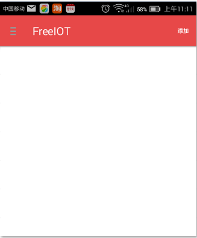
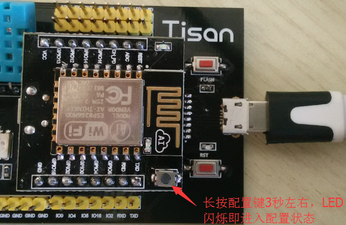
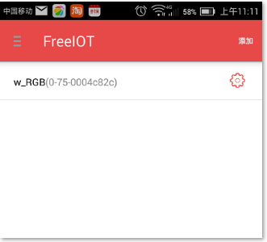
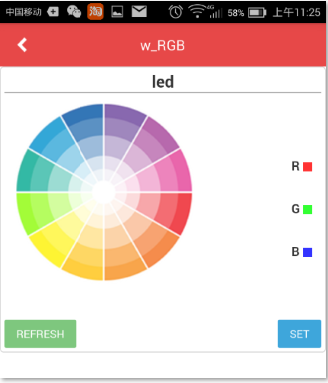

# Tisan快速体验  

## 体验Tisan  
首次拿到Tisan开发板，默认已经烧录三色灯的固件，可以立马体验！注意请在WiFi环境中体验，因为需要WiFi的SSID和密码。 

FreeIOT与设备之间通过smartconfig进行配置。FreeIOT是Tisan的在移动端的通用App，自由免费的，同时开源，有兴趣的开发者可在github下载[安卓版](https://github.com/PandoCloud/freeiot-android)或[IOS版](https://github.com/PandoCloud/freeiot-ios)的源码进行参考研究。
首先下载FreeIOT。  
- [安卓版下载地址](http://www.wandoujia.com/apps/com.pandocloud.freeiot)。  
- IOS版请在appstore里面搜索最新版本的FreeIOT，并下载安装。   
  

   
下面以安卓为例，介绍App与设备之间的操作流程：   
1. 安装**FreeIOT**  
    
  
2. 启动FreeIOT，如果没有账户，先注册用户，再登陆。  
注册用户：     
  
用户登陆：    
  
第一次进入的时候可以看到列表是空的：  
  
    
3. 长按Tisan开发板的配置键3秒，LED快闪，表示设备进入配置模式   
  
  
4. 点击FreeIOT右上角的“添加”键，输入能够联网的WiFi以及密码，输完后点击“确定”，静等5到10秒，配置成功后会返回设备列表界面,配置结束时LED灭；  
  
  
5. 如果没配成功，可重复操作步骤3和步骤4；  
6. 配置成功后，往下拉一下，刷新设备列表，找到刚配置成功的设备，点击进去，就进入操作该设备的主界面！用户可进行设备状态查询、远程控制等功能。   

  
点击进去可以看到如下控制界面：  
  
 

