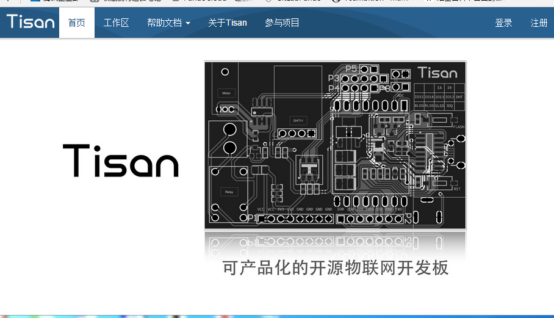
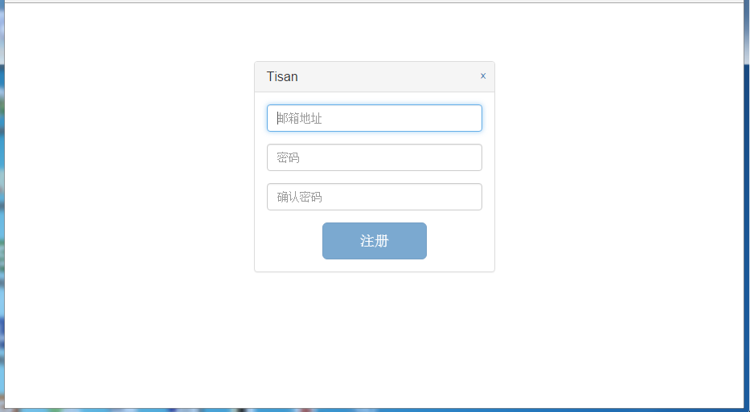
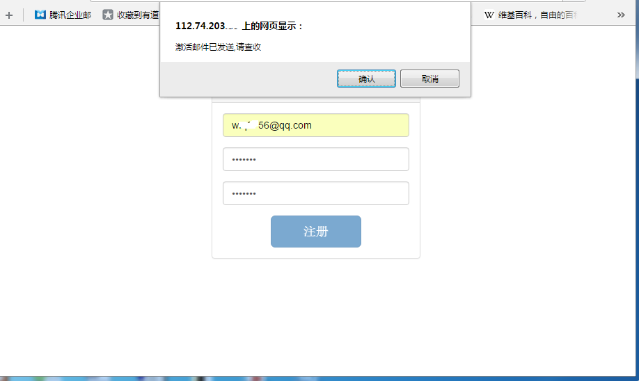
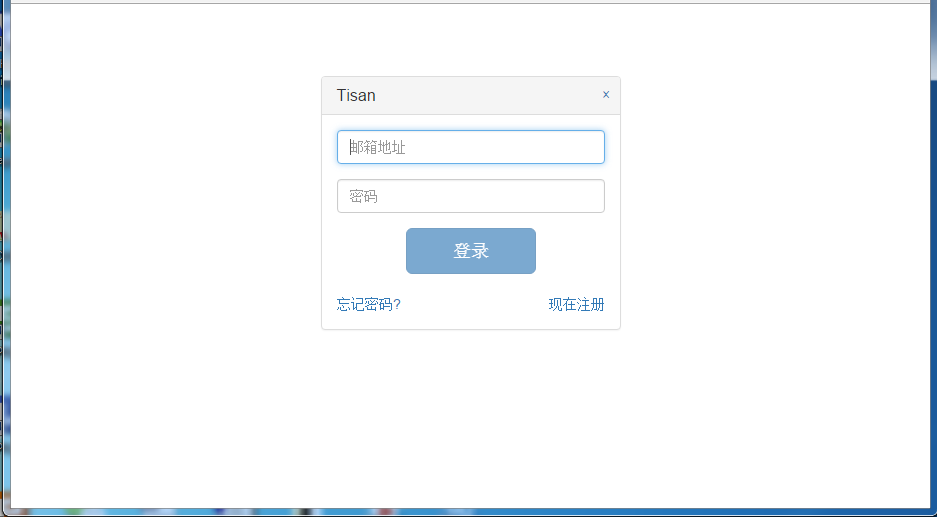
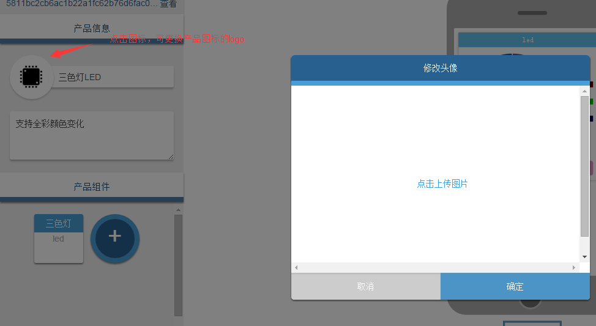
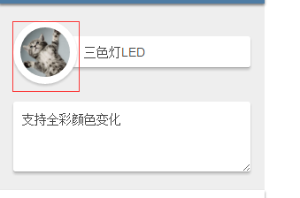

# WebIDE介绍
WebIDE首先是为了配合Tisan的pando开发框架而生，另外一方面，WebIDE给开发者提供了一个新的开发模式和开发思维，非常具有创新意义！当然更重要的是给开发者带来了简单、快速、高效的开发！  
WebIDE以可视化的界面进行呈现， 开发者通过WebIDE添加产品，在产品里面添加应用组件，把产品组件的自动生成代码拷贝到SDK的指定文件夹里的新建文件里，具体过程可参考[SDK固件开发](firmware.md)。   
WebIDE还提供微信二维码扫描，帮助用户使用微信接入的功能，具体详情可参考[微信支持](wechat-support.md)。  
 

## WebIDE开发指南  
  
进入[WebIDE](http://tisan.pandocloud.com)所在网址:  
  

1 注册用户:  
     

注册后会提示到注册邮箱激活:    
    

2 登陆账户:  
     

3 在工作区添加产品:  
  

4 获取产品Key，录入产品信息（产品名称、介绍），添加产品需要的组件，操作结束后保存:  
    

5 录入产品信息、介绍:  
    

6 添加产品需要的组件:  
   

7 添加完成后可直接浏览手机应用程序的界面:   
   

8 最后保存：    
  

9 另外，可进行更换产品logo  
  
点击“点击上传图片”  上传图片  
  
最后保存。  