# 微信支持  
本文档说明如何通过关注freeiot公众号对硬件进行联网控制。  

## 具体步骤    

1. 关注freeiot微信公众账号；
搜索微信公众号：freeiot  
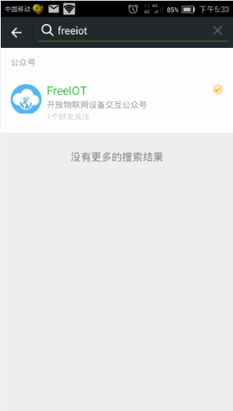  
点击FreeIOT，并关注:  
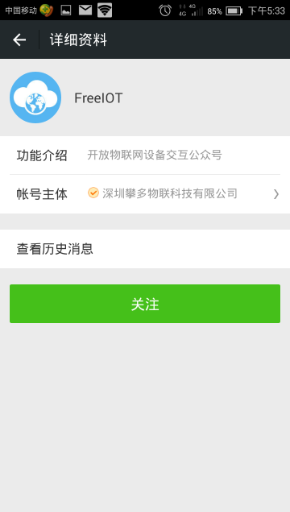   
  
2. 如果设备还没有连上网，需要对设备进行wifi联网配置；如果设备已经联上网了，直接进行第三步即可。长按配置键3秒,核心板上的绿色灯快速闪烁，表示设备进入wifi联网配置状态，微信公众号这边点击“添加设备”——>“WiFi配置”——>“开始配置”——>输入wifi账号密码——>配置中——>配置结束。示例图如下。  
在菜单选择“WiFi配置”：    
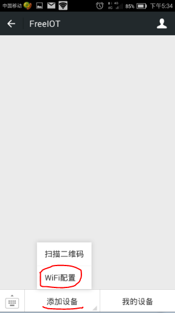    
点击“开始配置”：  
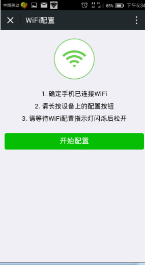  
输入wifi账号密码：  
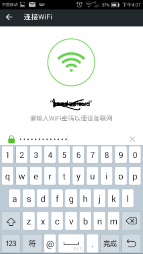  
联网配置中：  
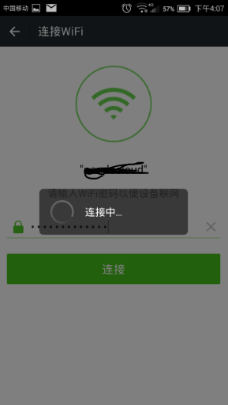  
配置结束：  
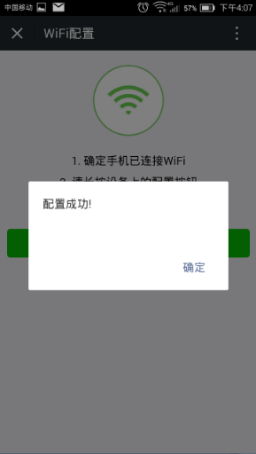  

   
3. 点击WebIDE手机图形界面下面的二维码按钮，点击公众号菜单中的扫描设备扫描二维码。如果设备的MAC地址还没有录入，WebIDE会提示录入MAC地址。具体过程如下：  
点击WebIDE下面的二维码按钮：    
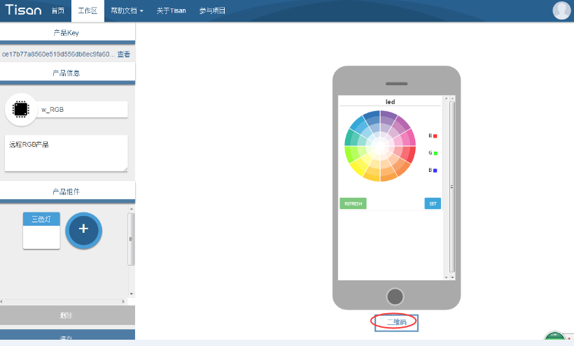  
如果没有录入设备的MAC地址，请录入MAC地址，设备的MAC地址可由烧写软件得出：  
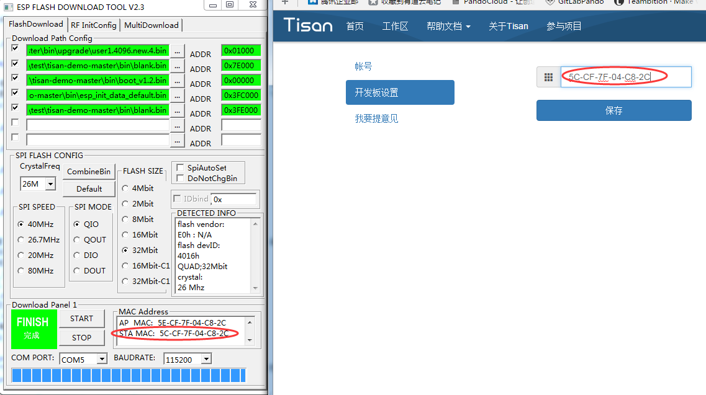   
再点击二维码按钮，即可出现生成的二维码图片：  
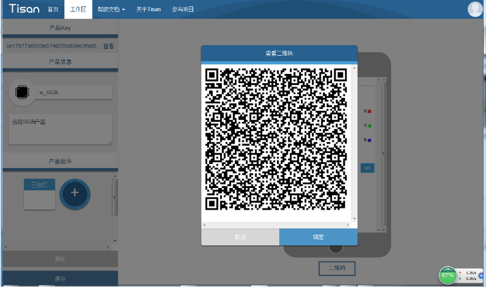
在微信公众号里点击“添加设备”，再点击“扫描二维码”的选项：  
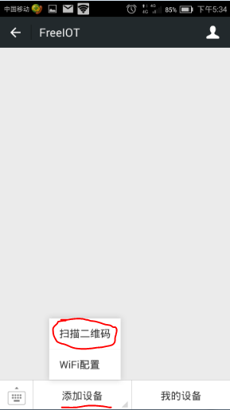   
扫描二维码图片：  
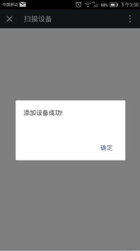  
添加设备成功，在“我的设备”里面会新增刚添加进来的设备，名称与WebIDE里面创建的产品名称相同：  
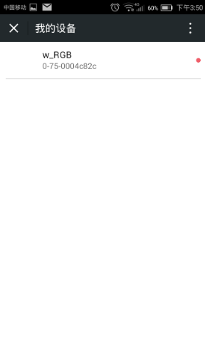 
 
4. 如果添加成功，便可以在我的设备菜单找到设备，进行控制测试。  
在“我的设备”里面找到要控制的设备，点击进入控制界面：  
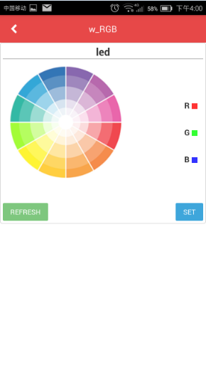 

   
