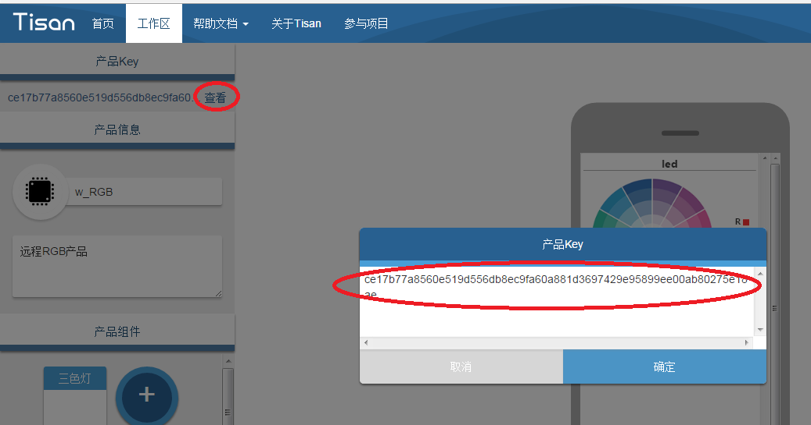
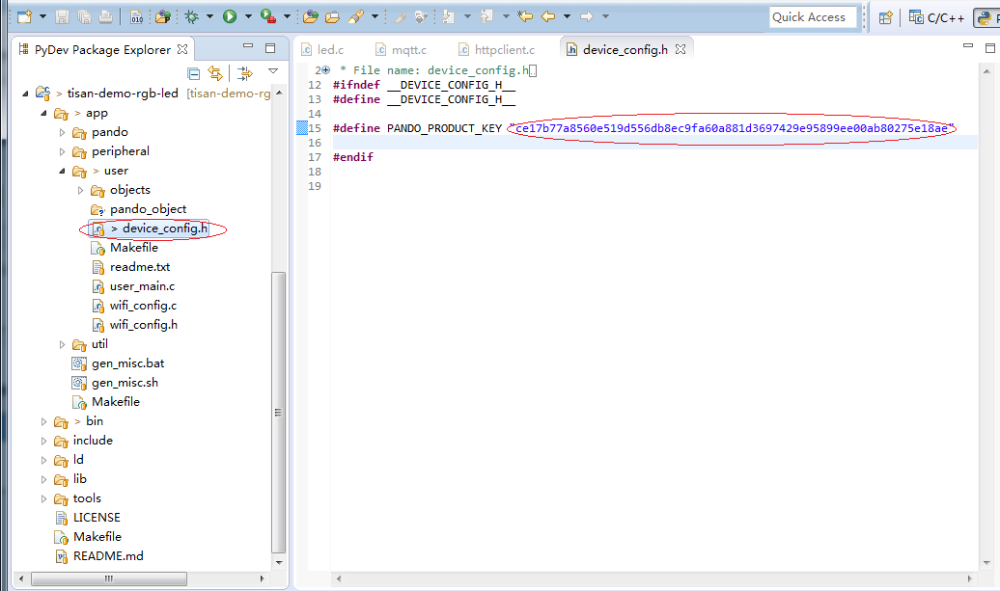
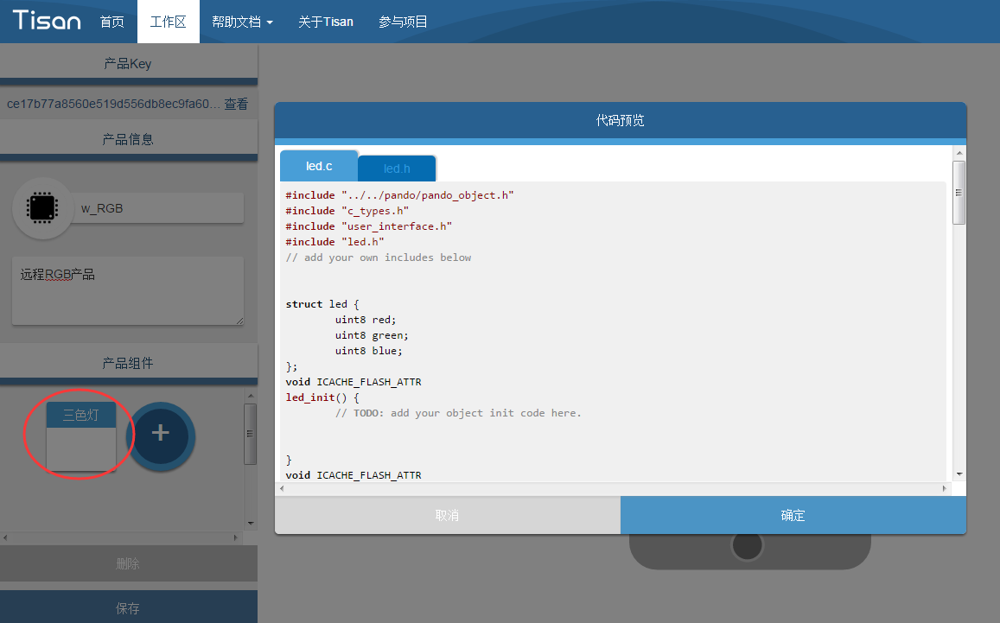
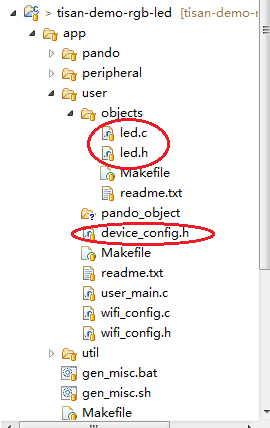

# 固件开发  

这里给开发者讲解如何进行固件开发，如何结合[WebIDE](http://tisan.pandocloud.com)开发自己的产品。

## 准备工作  
 搭建环境和准备好SDK，参考[快速开始](快速开始.md)  

## 在WebIDE中添加产品  
在WebIDE中添加产品，并保存。如何使用WebIDE可以参考[WebIDE开发](界面开发.md)  

## 取得产品Key  
在WebIDE的工作区添加产品，取得产品key：  
   
点击“查看”，在弹出框里将key的字符串复制到device_config.h文件中宏定义PANDO_PRODUCT_KEY的值。  
device_config.h文件在SDK的 **app/user** 目录下：  
   
  

## 组织产品组件代码   
点击WebIDE中产品组件区域所选的组件，会弹出一个代码预览框，该代码即为pando框架中object（组件）的基础代码，复制的SDK中 **app/user/objects** 目录下，只要稍作修改就可以使用。 下面示例是一个RGB灯的产品示例：  
   
代码预览中的led.c和led.h复制到SDK中 **app/user/objects** 目录下，如图：  
  
需要对led.c补充驱动代码，注意是补充代码中**TODO:**的函数：  

- 首先添加外设驱动的引用：    
`#include "../../peripheral/peri_rgb_light.h"`  
添加obj编号,**注意同一个工程里面的obj编号必须唯一**：  
`#define LED_OBJECT_NO 1`  
- 补充初始化函数，注意，初始化调用的外设请在**peripheral**中相应的驱动里面去配置：  
```  
void ICACHE_FLASH_ATTR
led_init()
{
	peri_rgb_light_init();
}
```

- 补充set和get方法，在这里是led_set以及led_get方法：  
```  
void ICACHE_FLASH_ATTR
led_set(struct led* value)  
{  
	struct LIGHT_PARAM light_value;  
	light_value.pwm_duty[0] = value->red;  
	light_value.pwm_duty[1] = value->green;  
	light_value.pwm_duty[2] = value->blue;  
	peri_rgb_light_param_set(light_value);  
}  
```  
```  
void ICACHE_FLASH_ATTR
led_get(struct led* value)
{
	struct LIGHT_PARAM light_value;
	light_value = peri_rgb_light_param_get();
	light_value.pwm_duty[0] = value->red;
	light_value.pwm_duty[1] = value->green;
	light_value.pwm_duty[2] = value->blue;
}
```  
- 另外如果object还有其他需要**TODO:**的地方，请参考TODO的提示来进行代码补充。  

好了代码补充完毕了，直接编译，生成bin文件，就可以对Tisan进行烧录了！


  


