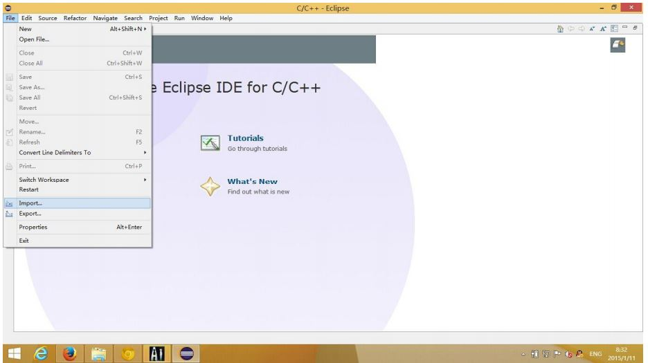
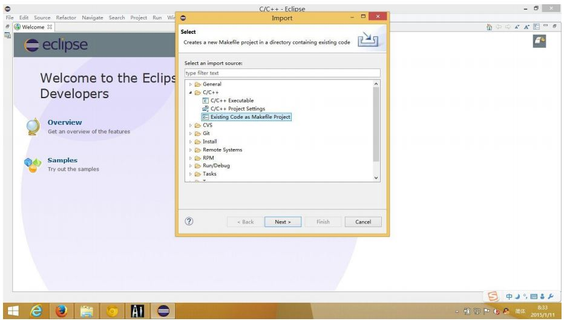
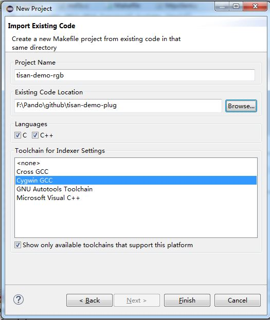
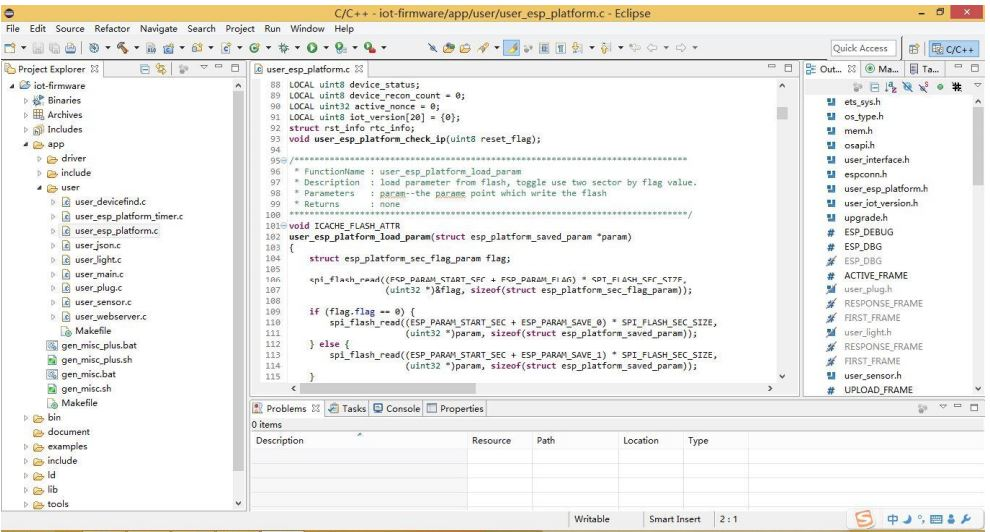
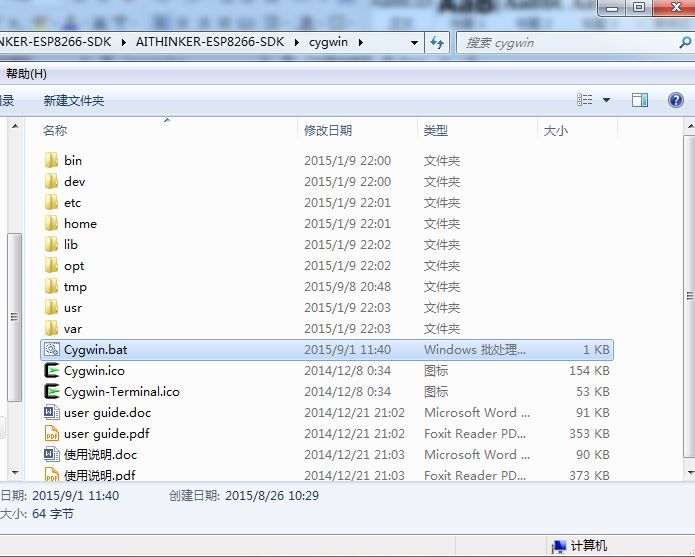
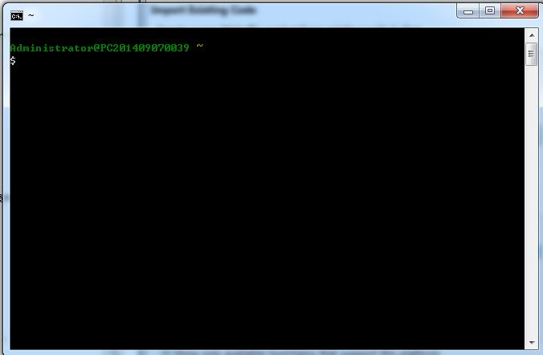
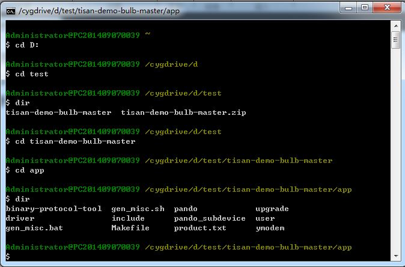

## 导读  
该文档说明**tisan**评估板的开发环境，主要涉及以下内容：  
- IDE编译环境  
- 如何用工具生成固件  
- 如何烧写固件  

## IDE编译环境  
可以到这里下载IDE：[**8266_SDK_IDE**](http://yun.baidu.com/s/1sjG2r2P)。  
解压缩后会得到以下文件：  
  
双击**ESP8266IDE**打开：  
  
这是IDE启动界面，需要等一会:)  
选择一个Workspace，然后等进度条走完：  
  

开始，准备导入工程，点击右上角的File：  
  
在Import界面选择**C/C++**下面的**Existing Code as Makefile Project**  
  
在Import现有代码的界面浏览选择要编辑/编译的工程，并在**Toolchain for Indexer Settings**里选择**Cygwin GCC**：  
  
好，然后所有高级特性都出来了，比如代码补全、自动代码分析，代码跟踪等。  
  
点击编译按钮，或者按Ctrl+B，编译整个工程：  
  
编译成功成后即生成bin固件。  
  

## 如何使用工具生成固件  
在下载[**8266_SDK_IDE**](http://yun.baidu.com/s/1sjG2r2P)后，里面打开目录**cygwin**（在windows环境下使用），双击执行**Cygwin.bat**  
  
出现命令行界面如下：  
  
用cd命令进入SDK/app 目录下：  
  
执行**./gen_misc.sh**,  
STEP 0：选择1， release；  
STEP 1：选择1， boot_v1.2+；  
STEP 2：选择1， user1.bin；  
STEP 3：选择2， 40MHz；  
STEP 4：选择0， QIO；  
STEP 5：选择4， 4096KB  
  

回车后将进行编译，如果编译成功则生成相应的bin文件到bin/upgrage文件夹中。  
 

## 如何烧写固件  
适用于存储空间大于4MB的flash（若flash大小小于4M，烧写方法会有所不同），不按该配置烧写将导致固件无法正常运行。  
烧写软件： flash_download_tool_v0.9.6_150419.exe  
烧写工具： 支持TTL电平的USB转串口的工具  
烧写方法如下：  

1. 打开烧写软件：flash_download_tool_v0.9.6_150419.exe;
2. 把bin文件放入对应栏并注意对应地址，前面记得打“√”;  
3. “SPI MODE”处为QIO(默认就是）;  
4. “FLASH SIZE”处改为“32Mbit（仅针对32Mbit的ESP12&ESP-12E）”，其他普通模块为8Mbit;  
5. "COM"选择对应的串口号，具体可以在电脑设备管理器上查看;  
6. 点击“START”然后重新上电即可；  
7. 将模块GPIO0与GND短接, 烧写的TxRx和gnd连线接好;  
8. 进度条不走的话可反复上电或者点击“STOP”后重新执行上一步;  
9. 烧写完成后GPIO 0拉高.  

  

烧写地址对应表（4M的flash）：  

| bin file | address offset |  
| -------- | -------------- |  
| boot_v1.2.bin | 0x00000 |  
| user1.4096.new.4.bin | 0x01000 |  
| esp_init_data_default.bin | 0x3FC000 |  
| blank.bin | 0x3FE000 |  

